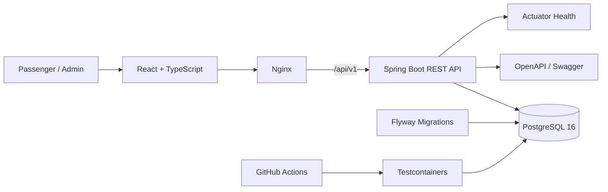
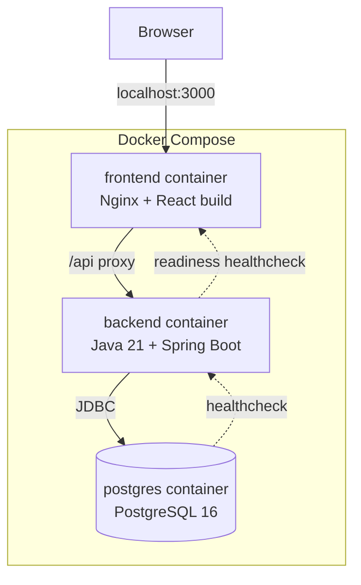
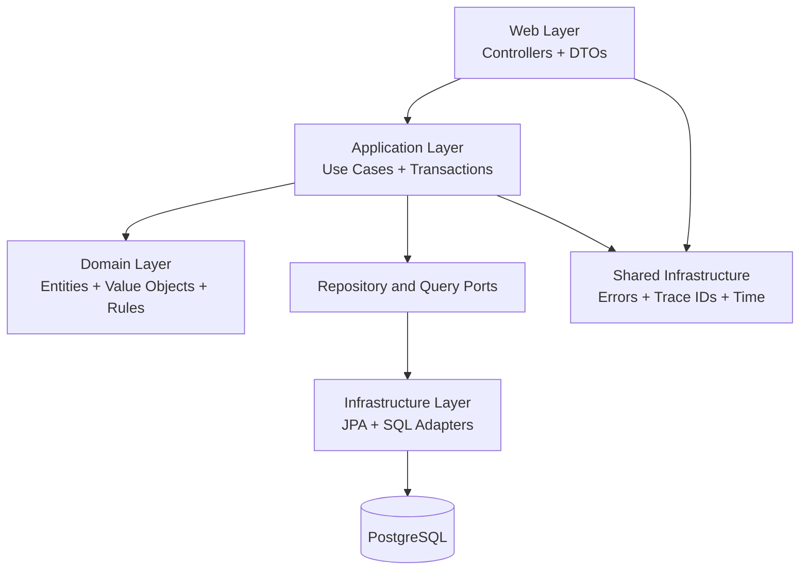
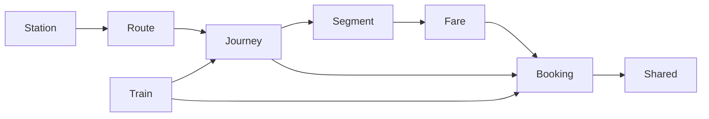
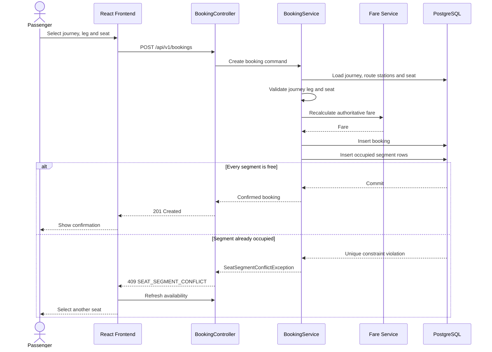
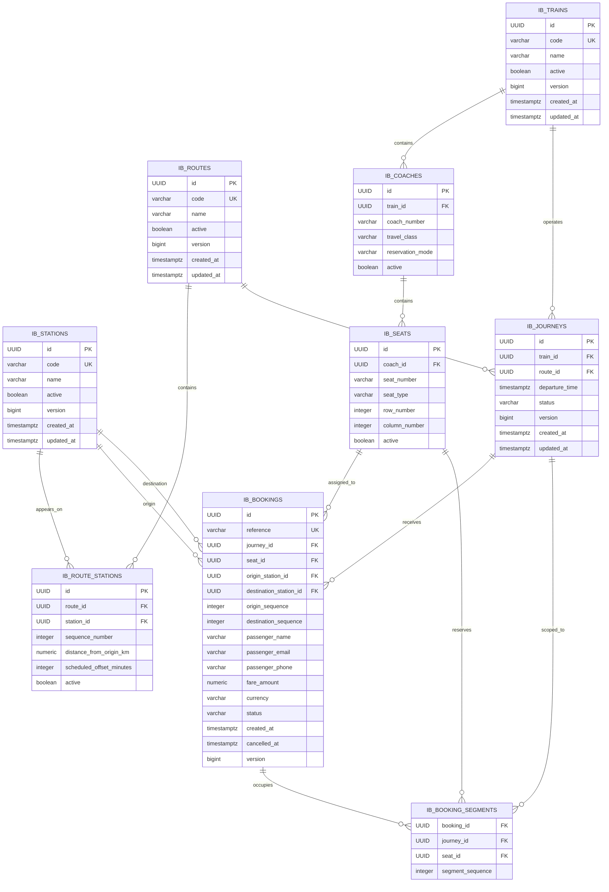
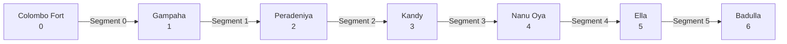
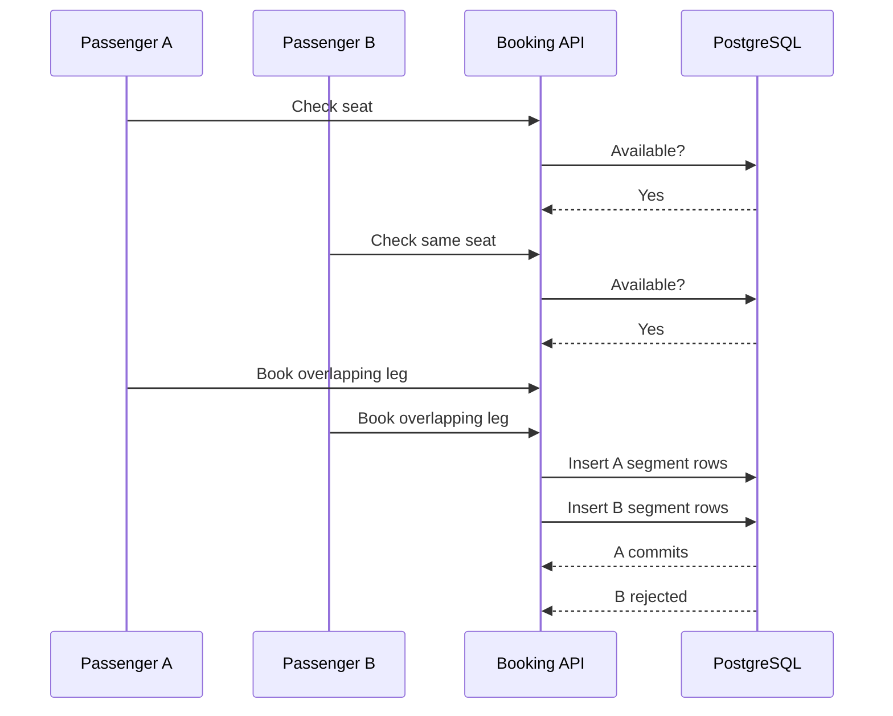

# IronBus - Segment-Based Train Seat Booking System

IronBus is a production-oriented full-stack booking application for Sri Lanka’s Colombo Fort–Badulla railway line.

The system allows one physical reserved seat to be sold independently for multiple **non-overlapping legs of the same train journey**. A passenger can book Colombo Fort → Kandy and another passenger can book Kandy → Badulla using the same seat, while each pays only for the distance travelled.

The implementation focuses on the central engineering problem: **guaranteeing correct segment-level seat ownership when overlapping and adjacent booking requests execute concurrently**.

---

## Table of Contents

- [Problem](#problem)
- [Solution Summary](#solution-summary)
- [Core Capabilities](#core-capabilities)
- [Technology Stack](#technology-stack)
- [Repository Structure](#repository-structure)
- [Quick Start](#quick-start)
- [Running Locally Without Docker](#running-locally-without-docker)
- [Seeded Demonstration Data](#seeded-demonstration-data)
- [System Architecture](#system-architecture)
- [Backend Architecture](#backend-architecture)
- [Booking Request Flow](#booking-request-flow)
- [Domain Model](#domain-model)
- [Database ERD](#database-erd)
- [Segment Occupancy Model](#segment-occupancy-model)
- [Seat Availability](#seat-availability)
- [Concurrency Guarantees](#concurrency-guarantees)
- [Cancellation and Seat Release](#cancellation-and-seat-release)
- [Fare Calculation](#fare-calculation)
- [User Experience](#user-experience)
- [API Overview](#api-overview)
- [API Error Contract](#api-error-contract)
- [Configuration](#configuration)
- [Health and Observability](#health-and-observability)
- [Security and Privacy](#security-and-privacy)
- [Testing Strategy](#testing-strategy)
- [Continuous Integration](#continuous-integration)
- [Design Decisions](#design-decisions)
- [Alternatives Considered](#alternatives-considered)
- [Challenges Encountered](#challenges-encountered)
- [Known Limitations](#known-limitations)
- [Future Improvements](#future-improvements)
- [Fresh-Machine Verification](#fresh-machine-verification)
- [AI Assistance Disclosure](#ai-assistance-disclosure)

---

## Problem

A conventional reserved-seat booking model may treat a seat as unavailable for the complete train journey even after its passenger leaves the train.

For example, when a passenger reserves a seat from Colombo Fort to Kandy, that seat may remain unavailable from Kandy to Badulla despite being physically vacant. This creates:

- under-utilized reserved coaches;
- lost revenue;
- unnecessarily expensive partial-route reservations;
- overcrowding in unreserved coaches;
- inefficient use of existing railway capacity.

IronBus makes occupancy specific to the **physical route segments travelled**, rather than the whole journey.

The design must also remain correct when multiple passengers attempt to reserve overlapping or adjacent journey legs of the same seat at the same time.

---

## Solution Summary

IronBus models each train service as a `Journey` over an ordered `Route`.

When a booking is confirmed:

1. The backend resolves the selected origin and destination on the journey route.
2. It derives the physical segment sequence values occupied by the passenger.
3. It recalculates the fare using distance and travel class.
4. It stores the booking.
5. It inserts one authoritative `BookingSegment` row per occupied seat segment.
6. PostgreSQL prevents duplicate ownership using:

```sql
UNIQUE (journey_id, seat_id, segment_sequence)
```

If two concurrent bookings overlap, only one transaction can commit the shared segment. The other request is rolled back and returned as `409 Conflict`.

Adjacent bookings do not conflict because journey legs use half-open intervals:

```text
[originSequence, destinationSequence)
```

---

## Core Capabilities

- Configurable stations
- Configurable routes and station ordering
- Configurable trains, coaches, and seats
- Reserved and unreserved coach modes
- Date- and time-specific journeys
- Journey search by route and date
- Origin and destination validation
- Journey-leg quote calculation
- Segment-specific seat availability
- Same-seat reuse for non-overlapping legs
- Transactional booking creation
- Database-enforced concurrent booking protection
- Booking confirmation
- Booking lookup by reference
- Booking search by passenger email
- Booking cancellation
- Immediate release of cancelled seat segments
- React booking workflow
- User-friendly navigation
- Recoverable booking-conflict UI
- Consistent API error responses
- Request trace IDs
- Strict CORS configuration
- Liveness and readiness endpoints
- OpenAPI and Swagger documentation
- PostgreSQL-backed tests with Testcontainers
- Docker Compose one-command startup
- GitHub Actions CI

---

## Technology Stack

### Backend

- Java 21
- Spring Boot
- Spring Web MVC
- Spring Data JPA
- Hibernate
- Jakarta Bean Validation
- PostgreSQL 16
- Flyway
- Spring Boot Actuator
- Springdoc OpenAPI
- Maven Wrapper
- Lombok

### Frontend

- React
- TypeScript
- Vite
- React Router
- TanStack Query
- Axios
- React Hook Form
- Zod

### Testing

- JUnit 5
- AssertJ
- Mockito
- MockMvc
- Spring Boot Test
- Testcontainers
- PostgreSQL Testcontainer
- Vitest
- React Testing Library

### Infrastructure

- Docker
- Docker Compose
- Nginx
- GitHub Actions

---

## Repository Structure

```text
ironbus/
├── .github/
│   └── workflows/
│       └── ci.yml
├── backend/
│   └── booking/
│       ├── .mvn/
│       ├── src/
│       │   ├── main/
│       │   │   ├── java/com/lsf/ironbus/
│       │   │   │   ├── booking/
│       │   │   │   ├── config/
│       │   │   │   ├── fare/
│       │   │   │   ├── journey/
│       │   │   │   ├── route/
│       │   │   │   ├── segment/
│       │   │   │   ├── shared/
│       │   │   │   ├── station/
│       │   │   │   └── train/
│       │   │   └── resources/
│       │   │       ├── db/migration/
│       │   │       ├── application.yml
│       │   │       └── application-dev.yml
│       │   └── test/
│       ├── Dockerfile
│       ├── mvnw
│       ├── mvnw.cmd
│       └── pom.xml
├── frontend/
│   └── booking-web/
│       ├── src/
│       ├── Dockerfile
│       ├── nginx.conf
│       ├── package.json
│       └── package-lock.json
├── compose.yml
├── .env.example
├── .gitignore
└── README.md
```

---

## Quick Start

### Prerequisites

- Git
- Docker Engine or Docker Desktop
- Docker Compose

Java, Maven, Node.js, npm, and PostgreSQL are not required for the containerized setup.

### 1. Clone the repository

```bash
git clone <YOUR_PUBLIC_REPOSITORY_URL>
cd ironbus
```

### 2. Create the local environment file

Linux or macOS:

```bash
cp .env.example .env
```

Windows PowerShell:

```powershell
Copy-Item .env.example .env
```

### 3. Start the complete application

```bash
docker compose up --build
```

Docker Compose will:

1. start PostgreSQL;
2. wait until PostgreSQL is healthy;
3. start the Spring Boot backend;
4. run Flyway migrations;
5. wait until backend readiness is `UP`;
6. start the React application through Nginx.

### Services

| Service | URL |
|---|---|
| Frontend | http://localhost:3000 |
| Admin UI | http://localhost:3000/admin |
| Backend API | http://localhost:8080/api/v1 |
| Swagger UI | http://localhost:8080/swagger-ui/index.html |
| OpenAPI JSON | http://localhost:8080/v3/api-docs |
| Health | http://localhost:8080/actuator/health |
| Liveness | http://localhost:8080/actuator/health/liveness |
| Readiness | http://localhost:8080/actuator/health/readiness |

### Stop the application

```bash
docker compose down
```

### Stop and delete local database data

```bash
docker compose down -v
```

Deleting the PostgreSQL volume removes locally created data. Flyway recreates the schema and demonstration data during the next startup.

---

## Running Locally Without Docker

### Start PostgreSQL

```bash
docker compose up postgres
```

### Backend

```bash
cd backend/booking
./mvnw spring-boot:run
```

Windows:

```powershell
cd backend/booking
.\mvnw.cmd spring-boot:run
```

### Frontend

```bash
cd frontend/booking-web
npm ci
npm run dev
```

```env
VITE_API_BASE_URL=http://localhost:8080/api
```

The Vite development server is normally available at `http://localhost:5173`.

---

## Seeded Demonstration Data

Flyway initializes demonstration railway data for the Colombo Fort–Badulla route.

The seeded dataset includes:

- ordered railway stations;
- cumulative station distances;
- a route;
- a train;
- reserved and unreserved coaches;
- configured seats;
- journey configuration;
- fare configuration.

The exact data is defined under:

```text
backend/booking/src/main/resources/db/migration/
```

The number of stations, coaches, and seats is database-configurable and is not hardcoded into booking logic.

---

## System Architecture



---

### Deployment View



---

## Backend Architecture

The backend is a modular monolith. Each domain feature is separated by package boundaries while remaining in one deployable process and one transaction boundary.



### Domain Modules



---

## Booking Request Flow



---

## Domain Model

### Station

```text
Station
- id
- code
- name
- active
- version
```

### Route

```text
Route
- id
- code
- name
- active
- version
```

### RouteStation

```text
RouteStation
- id
- routeId
- stationId
- sequenceNumber
- distanceFromOriginKm
- scheduledOffsetMinutes
- active
```

### Train

```text
Train
- id
- code
- name
- active
- version
```

### Coach

```text
Coach
- id
- trainId
- coachNumber
- travelClass
- reservationMode
- active
```

Reservation modes:

```text
RESERVED
UNRESERVED
```

### Seat

```text
Seat
- id
- coachId
- seatNumber
- seatType
- rowNumber
- columnNumber
- active
```

### Journey

```text
Journey
- id
- trainId
- routeId
- departureTime
- status
- version
```

### Booking

```text
Booking
- id
- reference
- journeyId
- seatId
- originStationId
- destinationStationId
- originSequence
- destinationSequence
- passengerName
- passengerEmail
- passengerPhone
- fareAmount
- currency
- status
- createdAt
- cancelledAt
- version
```

### BookingSegment

```text
BookingSegment
- bookingId
- journeyId
- seatId
- segmentSequence
```

---

## Database ERD

> Verify the final names against the Flyway migrations before submission.



### Main Database Constraints

```text
stations.code                                           UNIQUE
routes.code                                             UNIQUE
route_stations(route_id, station_id)                    UNIQUE
route_stations(route_id, sequence_number)               UNIQUE
trains.code                                             UNIQUE
coaches(train_id, coach_number)                         UNIQUE
seats(coach_id, seat_number)                            UNIQUE
journeys(train_id, departure_time)                      UNIQUE
bookings.reference                                      UNIQUE
booking_segments(journey_id, seat_id, segment_sequence) UNIQUE
```

```sql
CONSTRAINT uk_booking_segment_occupancy
    UNIQUE (journey_id, seat_id, segment_sequence)
```

---

## Segment Occupancy Model

| Sequence | Station |
|---:|---|
| 0 | Colombo Fort |
| 1 | Gampaha |
| 2 | Peradeniya |
| 3 | Kandy |
| 4 | Nanu Oya |
| 5 | Ella |
| 6 | Badulla |

```text
Segment 0: Colombo Fort → Gampaha
Segment 1: Gampaha → Peradeniya
Segment 2: Peradeniya → Kandy
Segment 3: Kandy → Nanu Oya
Segment 4: Nanu Oya → Ella
Segment 5: Ella → Badulla
```

```text
Colombo Fort → Kandy = [0, 3)
Occupied segments      = 0, 1, 2

Kandy → Badulla       = [3, 6)
Occupied segments      = 3, 4, 5
```



### Overlap Rule

```text
existing.start < requested.end
AND
requested.start < existing.end
```

```text
[0, 3) and [3, 6) → no overlap
[0, 3) and [1, 4) → overlap
```

---

## Seat Availability

The backend:

1. loads the journey;
2. resolves origin and destination;
3. verifies forward direction;
4. generates required segment sequences;
5. loads active seats from reserved coaches;
6. excludes seats occupied on any requested segment;
7. calculates the fare.

Conceptual SQL:

```sql
SELECT s.*
FROM seats s
JOIN coaches c ON c.id = s.coach_id
JOIN journeys j ON j.train_id = c.train_id
WHERE j.id = :journeyId
  AND c.reservation_mode = 'RESERVED'
  AND s.active = true
  AND NOT EXISTS (
      SELECT 1
      FROM booking_segments bs
      WHERE bs.journey_id = :journeyId
        AND bs.seat_id = s.id
        AND bs.segment_sequence >= :originSequence
        AND bs.segment_sequence < :destinationSequence
  );
```

An availability response is a snapshot. Booking remains authoritative.

---

## Concurrency Guarantees

### Race Condition



### Transaction Boundary

```text
BEGIN
- validate journey
- validate origin and destination
- validate seat and coach
- derive segments
- calculate fare
- insert booking
- insert booking segments
COMMIT
```

If one segment conflicts, the complete transaction rolls back.

### Final Correctness Boundary

```sql
UNIQUE (journey_id, seat_id, segment_sequence)
```

### Conflict Response

```http
409 Conflict
```

```json
{
  "timestamp": "2026-08-03T08:30:00Z",
  "status": 409,
  "code": "SEAT_SEGMENT_CONFLICT",
  "message": "The selected seat is no longer available for the requested journey leg.",
  "path": "/api/v1/bookings",
  "traceId": "5ae66002df0c43b8a900ec84c0926fa8"
}
```

Adjacent ranges claim different segment rows and may both commit.

---

## Cancellation and Seat Release

```http
POST /api/v1/bookings/{reference}/cancel
```

Within one transaction:

1. booking status changes to `CANCELLED`;
2. cancellation time is recorded;
3. booking-segment rows are removed;
4. the seat becomes available;
5. booking history remains.

---

## Fare Calculation

```text
distance = destination.distanceFromOriginKm - origin.distanceFromOriginKm
```

```text
fare = baseFare + distance × pricePerKilometre × classMultiplier
```

Example:

```text
Distance:                120 km
Base fare:               LKR 100
Price per kilometre:     LKR 8
Second-class multiplier: 1.25

Fare = 100 + 120 × 8 × 1.25
     = LKR 1,300.00
```

Money uses Java `BigDecimal`, scale `2`, and `RoundingMode.HALF_UP`.

The backend recalculates the authoritative fare and does not trust client-provided fare, currency, segment list, distance, or travel class.

---

## User Experience

### Journey Search

Passengers select date, origin, and destination. Invalid or reverse journey legs are prevented.

### Seat Selection

Available seats display coach, seat number, travel class, and fare.

### Passenger Details

The form collects full name, email, and phone.

### Booking Confirmation

The confirmation displays booking reference, journey, seat, route leg, fare, and status.

### Booking Management

Passengers can find bookings by reference or email and cancel confirmed bookings.

### Conflict Recovery

When a seat is booked by another passenger first, the frontend refreshes availability, clears the conflicted seat, preserves passenger details, and asks the user to select another seat.

---

## API Overview

Base path:

```text
/api/v1
```

### Status

```http
GET /api/v1/status
```

### Stations

```http
POST /api/v1/admin/stations
GET  /api/v1/stations
GET  /api/v1/stations/{stationId}
PUT  /api/v1/admin/stations/{stationId}
```

### Routes

```http
POST /api/v1/admin/routes
POST /api/v1/admin/routes/{routeId}/stations
GET  /api/v1/routes
GET  /api/v1/routes/{routeId}
GET  /api/v1/routes/{routeId}/stations
```

### Trains, Coaches and Seats

```http
POST /api/v1/admin/trains
GET  /api/v1/trains/{trainId}
POST /api/v1/admin/trains/{trainId}/coaches
POST /api/v1/admin/coaches/{coachId}/seats
```

### Journeys

```http
POST /api/v1/admin/journeys
GET  /api/v1/journeys?routeId={routeId}&date={yyyy-MM-dd}
GET  /api/v1/journeys/{journeyId}
```

### Quote

```http
GET /api/v1/journeys/{journeyId}/quote
    ?originStationId={originStationId}
    &destinationStationId={destinationStationId}
    &travelClass={travelClass}
```

### Available Seats

```http
GET /api/v1/journeys/{journeyId}/available-seats
    ?originStationId={originStationId}
    &destinationStationId={destinationStationId}
```

### Create Booking

```http
POST /api/v1/bookings
```

```json
{
  "journeyId": "d5f1028a-f9db-42fa-a7ae-42f8d3774b33",
  "seatId": "70d05ea5-830d-41b3-99f2-a125d9aceb1a",
  "originStationId": "e8c945ef-83e8-4f09-b50a-f7cfc28de424",
  "destinationStationId": "c59131c2-d942-4882-926b-33fe0f378c83",
  "passenger": {
    "name": "Test Passenger",
    "email": "passenger@example.com",
    "phone": "+94771234567"
  }
}
```

### Find Booking

```http
GET /api/v1/bookings/{reference}
GET /api/v1/bookings?passengerEmail={email}
```

### Cancel Booking

```http
POST /api/v1/bookings/{reference}/cancel
```

---

## API Error Contract

```json
{
  "timestamp": "2026-08-03T08:23:23.779633800Z",
  "status": 400,
  "code": "VALIDATION_FAILED",
  "message": "The request contains invalid values",
  "path": "/api/v1/bookings",
  "traceId": "5ae66002df0c43b8a900ec84c0926fa8",
  "fieldErrors": {
    "passenger.name": "Passenger name must contain between 2 and 150 characters",
    "passenger.phone": "Passenger phone number must be valid"
  }
}
```

| Code | Status |
|---|---:|
| `VALIDATION_FAILED` | 400 |
| `MALFORMED_REQUEST` | 400 |
| `STATION_NOT_ON_ROUTE` | 400 |
| `INVALID_JOURNEY_DIRECTION` | 400 |
| `JOURNEY_NOT_FOUND` | 404 |
| `SEAT_NOT_FOUND` | 404 |
| `BOOKING_NOT_FOUND` | 404 |
| `SEAT_NOT_RESERVABLE` | 409 |
| `SEAT_NOT_ON_JOURNEY_TRAIN` | 409 |
| `SEAT_SEGMENT_CONFLICT` | 409 |
| `JOURNEY_NOT_BOOKABLE` | 409 |
| `BOOKING_ALREADY_CANCELLED` | 409 |
| `RESOURCE_CONFLICT` | 409 |
| `INTERNAL_SERVER_ERROR` | 500 |

---

## Configuration

Example `.env.example`:

```env
POSTGRES_DB=ironbus
POSTGRES_USER=ironbus
POSTGRES_PASSWORD=replace_with_local_password
POSTGRES_PORT=5432
BACKEND_PORT=8080
FRONTEND_PORT=3000
FRONTEND_URL=http://localhost:3000
PUBLIC_API_URL=http://localhost:8080
APP_VERSION=1.0.0
SWAGGER_UI_ENABLED=true
OPENAPI_DOCS_ENABLED=true
```

The real `.env` file must not be committed.

Spring profiles:

```text
dev
test
```

Flyway owns schema changes. Hibernate uses `ddl-auto: validate`.

---

## Health and Observability

Each request receives a trace ID that is added to logs, returned in `X-Trace-Id`, included in errors, and displayed as a support reference.

```http
GET /actuator/health
GET /actuator/health/liveness
GET /actuator/health/readiness
GET /actuator/info
```

Readiness includes PostgreSQL connectivity. Passenger email and phone values are not written to operational logs.

---

## Security and Privacy

- Environment-based credentials
- `.env` excluded from Git
- Typed configuration validation
- Strict CORS origins
- No wildcard CORS
- Request validation
- Database constraints
- Sanitized API errors
- No client-facing stack traces
- Non-root backend container
- Limited Actuator exposure
- Server-side fare calculation
- No passenger data in operational logs
- Disabled SQL bind-value logging

Authentication is intentionally outside the current assessment scope.

---

## Testing Strategy

### Domain Tests

- validation and normalization;
- overlap and adjacency;
- journey direction;
- distance and fare;
- booking transitions;
- cancellation rules.

### Service Tests

- railway resource creation;
- journey scheduling;
- journey-leg resolution;
- quotes;
- booking creation;
- lookup and cancellation.

### PostgreSQL Integration Tests

- Flyway migrations;
- constraints;
- ordered routes;
- availability;
- occupancy persistence;
- cancellation release;
- journey and seat isolation.

### Controller Tests

- success responses;
- validation;
- malformed requests;
- structured errors;
- trace headers;
- CORS.

### Concurrency Tests

Expected for simultaneous overlapping attempts:

```text
1 success
N - 1 conflicts
```

Adjacent bookings are tested to confirm same-seat reuse.

### Frontend Tests

- search validation;
- loading states;
- seat rendering;
- passenger form;
- booking success;
- conflict recovery;
- booking management.

### Commands

```bash
cd backend/booking
./mvnw clean verify
```

```bash
cd frontend/booking-web
npm ci
npm run lint
npm run test -- --run
npm run build
```

---

## Continuous Integration

Backend CI:

```text
checkout → Java 21 → Maven cache → clean verify → Testcontainers
```

Frontend CI:

```text
checkout → Node setup → npm cache → npm ci → lint → test → build
```

Ensure:

```yaml
cache-dependency-path: frontend/booking-web/package-lock.json
```

Expected PR checks:

```text
Backend build        PASS
Backend tests        PASS
PostgreSQL tests     PASS
Frontend lint        PASS
Frontend tests       PASS
Frontend build       PASS
```

---

## Design Decisions

### Modular Monolith

Provides strong local transactions and low operational complexity.

### PostgreSQL as Source of Truth

Application checks improve messages; database constraints enforce integrity.

### Per-Segment Occupancy

Makes uniqueness, cancellation, and availability straightforward.

### Half-Open Intervals

`[origin, destination)` handles adjacency correctly.

### Server-Side Fare Calculation

Prevents client-side manipulation.

### Flyway Schema Ownership

Keeps schema changes explicit and repeatable.

### Testcontainers

Matches PostgreSQL production behavior.

### Immediate Confirmation

Payment and holds are outside the current scope.

---

## Alternatives Considered

| Area | Selected | Alternative | Reason |
|---|---|---|---|
| Architecture | Modular monolith | Microservices | Strong transactions and lower complexity |
| Occupancy | Per-segment rows | Interval-only booking | Direct uniqueness guarantee |
| Database | PostgreSQL | H2 | Real concurrency and constraints |
| Schema | Flyway | Hibernate auto-DDL | Explicit migrations |
| Concurrency | Transaction + unique constraint | Availability check only | Prevents races |
| Money | `BigDecimal` | `double` | Correct currency arithmetic |
| Fare authority | Backend | Frontend | Prevents manipulation |
| Cancellation | Status + segment deletion | Delete booking | Preserves history |
| Testing | Testcontainers | Shared DB | Isolated and reproducible |
| Deployment | Docker Compose | Manual setup | One-command startup |
| Authentication | Out of scope | Partial JWT | Core correctness prioritized |
| Real-time UI | Refresh after conflict | WebSockets | Lower complexity |

---

## Challenges Encountered

- Concurrent booking correctness
- Segment overlap and adjacency modelling
- Cancellation without losing history
- PostgreSQL-specific integration testing
- Configuration isolation in tests
- CI database availability
- Docker startup ordering
- Privacy-aware diagnostics

The central challenge was solved through transactional segment claims and database uniqueness.

---

## Known Limitations

- No authentication or RBAC
- No payment or refund processing
- No temporary seat holds
- No notifications
- No waitlisting
- No connecting journeys
- No return-ticket workflow
- No WebSocket availability
- Simplified fare model
- One-direction demonstration focus
- No production cloud deployment
- No full multilingual support

---

## Future Improvements

- JWT and RBAC
- Protected admin APIs
- Temporary holds
- Payments and refunds
- Idempotency keys
- Waitlisting
- Real-time availability
- Effective-dated fare rules
- Occupancy and revenue dashboard
- Multi-direction routes
- Return and connecting journeys
- Email and SMS notifications
- Rate limiting
- Audit logging

---

## Fresh-Machine Verification

```bash
git clone <YOUR_PUBLIC_REPOSITORY_URL> ironbus-verification
cd ironbus-verification
cp .env.example .env
docker compose up --build
```

Verify PostgreSQL, Flyway, readiness, frontend loading, journey search, seat availability, booking, lookup, email search, cancellation, Swagger, and CI.

```bash
docker compose down -v
```

---

## AI Assistance Disclosure

AI-assisted tools were used for planning, architecture review, debugging, testing strategy, CI troubleshooting, production-hardening review, and documentation drafting.

All suggestions were reviewed and adapted to the actual source code, database schema, API contracts, and runtime behavior. The implementation and its trade-offs can be explained and extended during a technical walkthrough.