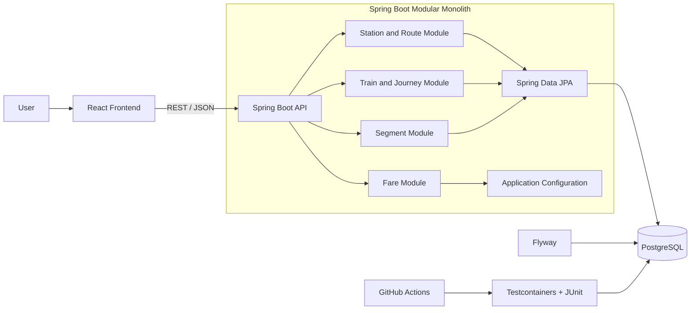
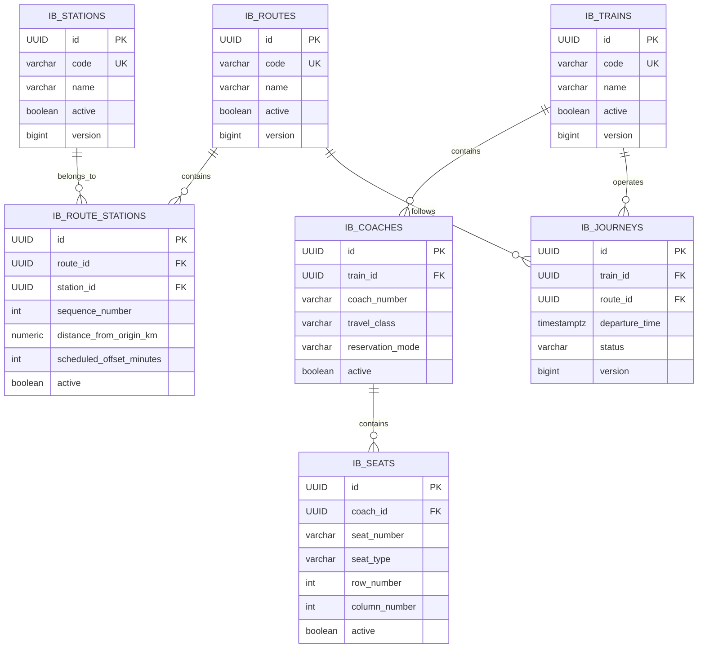

# IronBus — Segment-Based Train Seat Booking

IronBus is a full-stack train seat booking system that allows the same physical seat to be reused for **non-overlapping sections of the same journey**.

Example:

- Passenger A books Colombo Fort → Kandy
- Passenger B books Kandy → Badulla
- Both may use the same seat because their occupied segments do not overlap
- Each passenger pays only for the distance travelled

## Current progress

Completed:

- Phase 0 — Project foundation
- Phase 1A — Stations and routes
- Phase 1B — Trains, coaches, seats, and journeys
- Phase 2 — Segment resolution and fare calculation

Next:

- Phase 3 — Segment-specific seat availability
- Phase 4 — Transactional booking and concurrency protection
- Phase 5 — Frontend booking flow

---

## Core concept

A route is an ordered list of stations.

| Sequence | Station |
|---:|---|
| 0 | Colombo Fort |
| 1 | Gampaha |
| 2 | Kandy |
| 3 | Nanu Oya |
| 4 | Ella |
| 5 | Badulla |

A journey leg is represented as a half-open interval:

```text
[originSequence, destinationSequence)
```

Examples:

```text
Colombo Fort → Kandy = [0, 2) = segments 0 and 1
Kandy → Badulla       = [2, 5) = segments 2, 3, and 4
```

Adjacent ranges do not overlap.

```text
[0, 2) and [2, 5) → no overlap
[0, 2) and [1, 4) → overlap
```

Overlap rule:

```text
first.start < second.end
AND
second.start < first.end
```

---

## Project architecture

The system uses a modular monolith backend with a separate React frontend.



### Backend package structure

```text
com.lsf.ironbus
├── station
├── route
├── train
├── journey
├── segment
├── fare
└── shared
```

Each module generally follows:

```text
domain
enums
app
infra
web
```

This keeps the project simple while maintaining clear domain boundaries.

---

## ERD

The following ERD represents the persisted model completed up to Phase 2.

`SegmentRange`, `JourneyLeg`, and `Fare` are value objects calculated in the application and are not stored as separate tables.



### Main database constraints

```text
stations.code                                  UNIQUE
routes.code                                    UNIQUE
route_stations(route_id, station_id)           UNIQUE
route_stations(route_id, sequence_number)      UNIQUE
trains.code                                    UNIQUE
coaches(train_id, coach_number)                UNIQUE
seats(coach_id, seat_number)                   UNIQUE
journeys(train_id, departure_time)             UNIQUE
```

---

## Technology stack

### Backend

- Java 21
- Spring Boot
- Spring MVC
- Spring Data JPA
- Hibernate
- Jakarta Validation
- PostgreSQL 16
- Flyway
- Maven Wrapper

### Frontend

- React
- TypeScript
- Vite
- TanStack Query
- Axios
- React Hook Form
- Zod

### Testing and infrastructure

- JUnit 5
- AssertJ
- Mockito
- MockMvc
- Testcontainers
- Docker Compose
- GitHub Actions

---

## Phase 0 — Foundation

Phase 0 established:

- Monorepo structure
- Spring Boot backend
- React frontend
- PostgreSQL database
- Flyway migrations
- Docker Compose startup
- Maven Wrapper
- GitHub Actions CI
- Testcontainers support

Start all services:

```bash
docker compose up --build
```

Run backend tests:

```bash
cd backend/booking
./mvnw clean verify
```

Windows PowerShell:

```powershell
cd backend/booking
.\mvnw.cmd clean verify
```

---

## Phase 1A — Stations and routes

Phase 1A introduced:

- `Station`
- `Route`
- `RouteStation`
- Ordered stations within a route
- Cumulative distance from the route origin
- Scheduled offset in minutes

A route station stores:

```text
sequenceNumber
distanceFromOriginKm
scheduledOffsetMinutes
```

Distance between two stations is calculated as:

```text
destinationDistanceFromOrigin - originDistanceFromOrigin
```

Example API operations:

```http
POST /api/v1/admin/stations
POST /api/v1/admin/routes
POST /api/v1/admin/routes/{routeId}/stations
GET  /api/v1/routes/{routeId}/stations
```

---

## Phase 1B — Trains, coaches, seats, and journeys

Phase 1B introduced:

- `Train`
- `Coach`
- `Seat`
- `Journey`

### Coach modes

```text
RESERVED
UNRESERVED
```

Only reserved coaches contain individually bookable seats.

### Travel classes

```text
FIRST_CLASS
SECOND_CLASS
THIRD_CLASS
```

### Seat types

```text
WINDOW
AISLE
MIDDLE
OTHER
```

### Journey statuses

```text
SCHEDULED
BOARDING
DEPARTED
COMPLETED
CANCELLED
```

A journey links:

```text
one train
one route
one departure time
```

Example API operations:

```http
POST /api/v1/admin/trains
POST /api/v1/admin/trains/{trainId}/coaches
POST /api/v1/admin/coaches/{coachId}/seats
POST /api/v1/admin/journeys
GET  /api/v1/journeys?routeId={routeId}&date={date}
```

Journey timestamps are stored as UTC instants. Service dates are interpreted using `Asia/Colombo`.

---

## Phase 2 — Segment resolution and fare calculation

Phase 2 introduced:

- `SegmentSequence`
- `SegmentRange`
- `JourneyLeg`
- `Fare`
- `FarePolicy`
- `DistanceBasedFarePolicy`
- Journey-leg quote endpoint

### Journey-leg validation

A journey leg is valid only when:

- The journey exists
- The journey is available
- Origin and destination differ
- Both stations belong to the journey route
- Origin appears before destination
- Destination distance is greater than origin distance

### Segment generation

```java
new SegmentRange(1, 4)
```

represents:

```text
segments 1, 2, and 3
```

### Fare formula

```text
fare = max(
    minimumFare,
    baseFare + distanceKm × pricePerKm × classMultiplier
)
```

Example configuration:

```yaml
app:
  fare:
    currency: LKR
    base-fare: 100.00
    price-per-km: 8.00
    minimum-fare: 150.00
    class-multipliers:
      FIRST_CLASS: 1.75
      SECOND_CLASS: 1.25
      THIRD_CLASS: 1.00
```

Example:

```text
Distance: 120 km
Base fare: LKR 100
Price per km: LKR 8
Second-class multiplier: 1.25

Fare = 100 + 120 × 8 × 1.25
     = LKR 1,300.00
```

All monetary calculations use `BigDecimal` with two-decimal `HALF_UP` rounding.

### Quote endpoint

```http
GET /api/v1/journeys/{journeyId}/quote
    ?originStationId={originStationId}
    &destinationStationId={destinationStationId}
    &travelClass=SECOND_CLASS
```

Example response:

```json
{
  "journeyId": "70000000-0000-0000-0000-000000000001",
  "originStationId": "10000000-0000-0000-0000-000000000001",
  "destinationStationId": "10000000-0000-0000-0000-000000000004",
  "originSequence": 0,
  "destinationSequence": 2,
  "segmentSequences": [0, 1],
  "distanceKm": 120.00,
  "travelClass": "SECOND_CLASS",
  "fareAmount": 1300.00,
  "currency": "LKR"
}
```

The quote is informational. The future booking service must recalculate the journey leg and fare before confirming a booking.

---

## Database migrations

Flyway manages schema changes.

```text
V1__create_railway_resource_tables.sql
    .
    .
    .
```

Do not edit migrations already applied to a persistent database. Add a new migration for each schema change.

To reset local data:

```bash
docker compose down -v
docker compose up --build
```

---

## Configuration

Example backend configuration:

```yaml
spring:
  datasource:
    url: ${DB_URL:jdbc:postgresql://localhost:5432/ironbus}
    username: ${DB_USERNAME:ironbus}
    password: ${DB_PASSWORD:ironbus}

  jpa:
    open-in-view: false
    hibernate:
      ddl-auto: validate
    properties:
      hibernate:
        jdbc:
          time_zone: UTC

  flyway:
    enabled: true

app:
  railway:
    zone-id: Asia/Colombo
```

---

## Testing

The test strategy contains:

### Unit tests

- Entity and value-object validation
- Segment overlap and adjacency
- Distance calculation
- Fare calculation and rounding

### Service tests

- Train and coach creation
- Seat rules
- Journey scheduling
- Journey-leg resolution
- Quote generation

### Repository tests

- PostgreSQL constraints
- Ordered route stations
- Distance precision
- Journey fetch queries

### Integration tests

- Real PostgreSQL through Testcontainers
- Flyway migration validation
- Journey-leg resolution using persisted data
- Fare calculation through the complete Spring service flow

Run:

```bash
./mvnw clean verify
```

---

## Main design decisions

### Modular monolith

A modular monolith keeps deployment and transactions simple while preserving clear domain boundaries.

### PostgreSQL as the source of truth

Application validation provides useful errors, while database constraints protect integrity.

### Half-open segment ranges

`[origin, destination)` allows adjacent bookings to reuse the same physical seat without overlap.

### Cumulative route distance

The system subtracts cumulative distances rather than repeatedly summing every intermediate segment.

### Server-side fare calculation

The client never becomes the fare authority.

### DTO-based APIs

Controllers do not expose JPA entities directly.

---

## Error format

```json
{
  "timestamp": "2026-08-02T00:00:00Z",
  "status": 400,
  "code": "INVALID_JOURNEY_DIRECTION",
  "message": "Destination must appear after origin",
  "path": "/api/v1/journeys/{id}/quote",
  "traceId": "5d0db51b-639a-4fe5-8cbc-099ca3743c9d"
}
```

Typical mappings:

| Error | Status |
|---|---:|
| Resource not found | 404 |
| Validation failure | 400 |
| Station not on route | 400 |
| Invalid direction | 400 |
| Duplicate resource | 409 |
| Journey unavailable | 409 |
| Unexpected error | 500 |

---

## Current limitations

The following are not included by the end of Phase 2:

- Segment-specific seat availability
- Booking creation
- Booking cancellation
- Concurrent booking protection
- Idempotency
- Authentication
- Payments
- Notifications
- Waitlists

---

## Next phase

Phase 3 will add segment-specific seat availability.

The backend will return only seats whose required segments are currently free. Availability will remain a snapshot; final booking correctness will later be enforced by transactional segment claims and a database uniqueness constraint.
